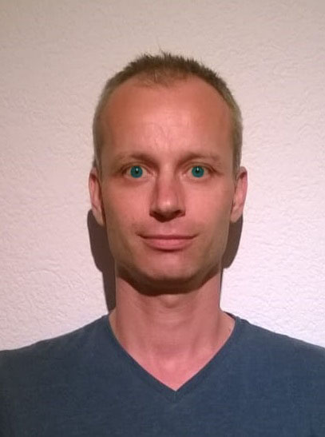
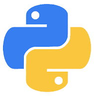

# Dalibor Sova
**Programátor v jazyce Python**  [*(prezentační video)*](https://youtu.be/KOqlBM_7sdk)

---
[[*switch to Englis*]](data/README[en].md) • [[*stáhnout pdf*]](data/downloads/CV_Dalibor_Sova.pdf) • [[*stáhnout word*]](data/downloads/CV_Dalibor_Sova.docx)

### Profil
Jsem samostatný a motivovaný programátor specializující se na Python s vášní pro webové aplikace. Mám silné logické uvažování a schopnost nadhledu, což mi umožňuje efektivně řešit problémy. Hledám práci, kterou lze vykonávat plně z domova.

---

### Klíčové znalosti
- Python, Django, Flask, HTML, CSS, JS
- Práce s databázemi, Testování
- Docker, Git
- Linux server, Ubuntu, Bash
- Deployment, SEO, Google Analytics
- Adobe: Photoshop, InDesign, Illustrator, Premiere, Audition

### Klíčové dovednosti
- Full Stack Developer
- Základy UX/UI designu
- Psaní technické dokumentace
- Schopnost rychle se učit a adaptovat na nové technologie
- Schopnost identifikovat a vyřešit problémy
- Samostatnost a schopnost online komunikace

---

### Pracovní zkušenosti

[**Django Web Developer**](https://github.com/Sudip2708/DjangoBlogWeb)          
*Freelancer*  
*Prosinec 2023 – Červen 2024*  
- Vypracování zkušebního úkolu v Django
- Vytvoření webových stránek pro správu článků s kategoriemi a tagy
- Učení se Django do hloubky, včetně nejlepší praxe a strukturálních principů
- Kontejnerizace aplikace pomocí Dockeru a publikace obrazu na DockerHubu
       
[**Web Developer (Flask)**](https://github.com/Sudip2708/poustovnik-english)                  
*Freelancer*  
*Srpen 2023 – Listopad 2023*  
- Vytvoření webových stránek ve Flasku pro správu uživatelů a textových příspěvků
- Implementace lokalizace stránek do českého jazyka a překládání obsahu pomocí Google Translatoru  
- Nasazení do produkčního prostředí na Linux serveru Linode  
- Úspěšná SEO optimalizace stránek, které se díky tomu objevovaly na prvním místě ve výsledcích vyhledávání Google
- Kontejnerizace aplikace pomocí Dockeru a publikace obrazu na DockerHubu

[**Kurz programování webových aplikací**](data/Osveceni_IT_Network_small.jpg)       
*IT Network*  
*Duben 2023 – Červenec 2023*  
- Naučení základů webového programování v Pythonu
- Práce s HTML, CSS a databázemi  

[**Programátor Python**](https://github.com/Sudip2708/Python-Exercises)    
*Freelancer*  
*Leden 2022 – Duben 2023*  
- Učení se Pythonu podle materiálů Andreje Blaha
- Vytvoření hry Orbital, simulace sluneční soustavy  

---

### Vzdělání

[**Kurz programátora webových aplikací**](data/Osveceni_IT_Network_small.jpg)   
*IT Network, Duben 2023 – Červenec 2023*

[**Samostudium Pythonu**](https://github.com/Sudip2708/Python-Exercises)   
*Podle materiálů Andreje Blaha, Leden 2022 – Duben 2023*

---

### Projekty

[**Orbital**](https://github.com/Sudip2708/Orbital-0.7) - Hra simulující sluneční soustavu, vytvořená během studia Pythonu

[**Poustovnik**](https://github.com/Sudip2708/poustovnik-english) - Webová aplikace ve Flasku pro správu uživatelů a příspěvků, včetně lokalizace a překladu

[**DjangoBlogWeb**](https://github.com/Sudip2708/DjangoBlogWeb) - Webové stránky pro správu článků v Django, včetně kategorií a tagů

---

### Osobní vlastnosti
- Přátelský a komunikativní
- Cit pro druhé a schopnost hledání shody
- Důsledný a spolehlivý

---

### Kontaktní informace
- Telefon: +420 704 564 595
- Email: daliborsova@seznam.cz
- LinkedIn: [dalibor-sudip-sova](https://www.linkedin.com/in/dalibor-sudip-sova)

---

### Předchozí pracovní zkušenosti
Pro podrobnosti o mých předchozích pracovních zkušenostech, které nesouvisejí s programováním, navštivte [tento odkaz](data/predchozi_zkusenosti.md).
