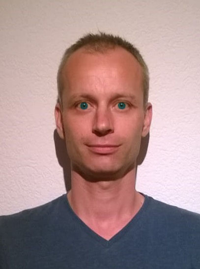
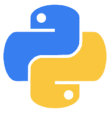
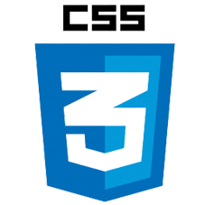
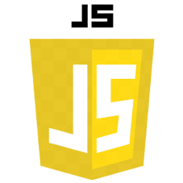

# Dalibor Sova
**Python Programmer**

---
[[*switch to Czech*]](../README.md)

### Profile
I am a self-sufficient and motivated programmer specializing in Python with a passion for web applications. I possess strong logical thinking and the ability to see the big picture, allowing me to solve problems effectively. I am seeking a fully remote job.

---

### Key Skills
- Python  
- Django
- Flask
- HTML, CSS, JS
- Database management
- Ability to quickly learn and adapt to new technologies
- Independence and online communication skills

---

### Work Experience

[**Django Web Developer**](https://github.com/Sudip2708/DjangoBlogWeb)  
*Freelancer*  
*December 2023 – June 2024*  
- Completed a trial task in Django
- Created a website for managing articles with categories and tags
- Learned Django in-depth, including best practices and structural principles  
     

[**Web Developer (Flask)**](https://github.com/Sudip2708/poustovnik-english)  
*Freelancer*  
*August 2023 – November 2023*  
- Created a website in Flask for user and text post management
- Implemented site localization into Czech and content translation using Google Translator  
    

[**Web Application Programming Course**](data/Osveceni_IT_Network_small.jpg)  
*IT Network*  
*April 2023 – July 2023*  
- Learned the basics of web programming in Python
- Worked with HTML, CSS, and databases  
   

[**Python Programmer**](https://github.com/Sudip2708/Python-Exercises)  
*Freelancer*  
*January 2022 – April 2023*  
- Learned Python using materials by Andrej Blaho
- Created the game Orbital, a simulation of the solar system  

---

### Education

[**Web Application Programming Course**](data/Osveceni_IT_Network_small.jpg)  
*IT Network, April 2023 – July 2023*

[**Self-study of Python**](https://github.com/Sudip2708/Python-Exercises)  
*Using materials by Andrej Blaho, January 2022 – April 2023*

---

### Projects

[**DjangoBlogWeb**](https://github.com/Sudip2708/DjangoBlogWeb) - A website for managing articles in Django, including categories and tags  

[**Poustovnik**](https://github.com/Sudip2708/poustovnik-english) - A web application in Flask for user and post management, including localization and translation  

[**Orbital**](https://github.com/Sudip2708/Orbital-0.7) - A game simulating the solar system, created during Python studies  

---

### Personal Qualities
- Friendly and communicative
- Able to find solutions and reach agreements
- Thorough and reliable

---

### Contact Information
- Phone: +420 704 564 595
- Email: daliborsova@seznam.cz
- LinkedIn: [dalibor-sudip-sova](https://www.linkedin.com/in/dalibor-sudip-sova)

---

### Previous Work Experience
For details about my previous work experiences unrelated to programming, please visit [this link](previous_experiences.md).
