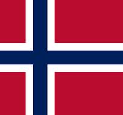
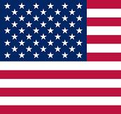

# [Dalibor Sova](README[en].md)
**Previous Work Experience**

---

**Security Guard (learned Python during this time)**  
*Fluorit CZ a.s., Důlní 508, 41510 Teplice*  
*July 2021 – March 2023*  

**Driver**  
*Spokojený Pes, Černokostelecká 2246, 25101 Říčany*  
*September 2019 – January 2021*

**Driver**  
*Rohlík.cz, U Silnice Liboc, 16100 Praha 6*  
*June 2019 – September 2019*

**Elevator Service Technician**  
*Výtahy Petersik, s.r.o. Bohosudovská 459, 41510 Sobědruhy*  
*January 2019 – April 2019*

**Warehouse Worker (Jungheinrich EKX 410, EFG115 Operator)**  
*Madal Bal, Müliwisstrasse 139, 05467 Fisibach, Switzerland*   
*July 2018 – December 2018*

**Barista (Oslo Cafe)**  
*The Fragrance of the Heart Fridtjof Nansens plass 2, 00160 Oslo, Norway*   
*March 2018 – July 2018*

**Cook (vegetarian restaurant in NY)**  
*The Oneness-Fountain-Heart, 157-19 72nd Ave, 11367 Flushing, USA*   
*August 2017 – November 2017*

**Warehouse Worker**  
*Zdravý den, Mladoboleslavská 968, 19700 Prague 19*  
*April 2017 – May 2017*

**Waiter (vegetarian restaurant in San Francisco)**  
*Ananda Fuara, 1298 Market St, 94102 San Francisco, CA, USA*     
*July 2016 – August 2016*

**Service and Customer Center Madal Bal**  
*Madal Bal a.s. Letovská 532, 19900 Prague 18*  
*November 2004 – March 2017*

**Warehouse Worker**  
*Madal Bal a.s. Průmyslová zóna Příluky, 76001 Zlín*  
*November 2003 – November 2004*

**Graphic Designer**  
*Madal Bal a.s. Přemyšlenská 220/78, 18200 Prague 8*  
*June 2002 – November 2003*

**Assistant**  
*Rubicon Praha, s.r.o. Lomnického 6, 14000 Prague 4*  
*July 2001 – June 2002*

**Librarian (civil service position)**  
*Regional Library, Lípová 796/13, 41501 Teplice*  
*July 1999 – January 2001*

**Cook**  
*Restaurant Podletná, U Kamenných Lázní 557, 41501 Teplice*  
*August 1997 – August 1998*

---

### Education

**Cook**  
*SOU Společného stravování, Smetanovo nám. 786/1, 41501 Teplice*  
*September 1992 – June 1995*
